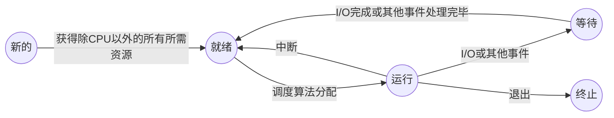

东南大学-操作系统-期末复习笔记

# part 1

## 操作系统概念

管理各种资源、支持程序运行、方便用户使用的**程序集**

是一种**接口**程序、**控制**程序、**分配**程序、**内核**程序

用户使用、访问各种硬件的**接口**interface

**控制**用户程序的运行，避免错误与计算机的不正确使用control

**分配**、回收硬件资源allocation

一种**内核**程序，一直运行在计算机上。其他程序都是系统程序和应用程序kernel

## 操作系统的基本目标

确保用户使用计算机资源的**方便性**convenience和计算机资源分配的**高效性**efficient

## 操作系统相关的硬件

* 引导程序

  存在ROM或EPROM中，开机时将操作系统内核载入内存

* **中断**

  中断是能够引起操作系统注意的一种事件，该事件能够驱动操作系统进行工作。

  * 软中断

    是由程序执行中断指令产生的，软中断的发生是有序的、可控的。

  * 硬中断

    是由外设引发的，硬中断的发生是随机的、突发的。

  操作系统是由中断驱动工作的，当产生一个中断时，当前正在执行的程序被挂起，同时保留当前状态，系统控制权交给操作系统，操作系统通过查找中断向量调用相应的中断处理程序。中断处理结束后返回被挂起的程序继续执行。

## 存储结构

内存——小、易失

二级存储——大、非易失

寄存器

高速缓存

主存

电子磁盘

磁盘

光盘

磁带

由上到下容量增大，越不易失，访问速度越慢

## I/O结构

* 每个设备控制器负责一个特定的设备类型，并有一个本地缓冲区。CPU将数据从主存移动到本地缓冲区。设备控制器通过中断通知CPU它已经完成了它的操作。

  这种中断驱动的I/O形式适用于移动少量数据，但如果用于批量数据移动(如磁盘I/O)，则会产生很高的开销。

* 对于批量数据采用DMA（直接内存访问）

  设备控制器直接在缓冲存储器和主存之间传输数据块，不需要CPU的干预。每个块只产生一个中断，而不是每个字节产生一个中断。用于能够以接近内存速度传输信息的高速I/O设备。

## 硬件保护

* 双重模式操作

  共享系统资源需要操作系统来确保不正确的程序不会导致操作系统或其他程序错误执行。

  提供硬件支持，以区分至少两种操作模式。

  * 用户模式,代表用户执行完成。(用户态或目态)

  * 内核模式(也可以是监控模式、系统模式或特权模式)——代表操作系统执行。(核心态或管态)

  模式位加到计算机硬件以指示当前模式:内核(0)或用户(1)。

  当中断或故障发生时，硬件从用户模式切换到内核模式。

  处理系统调用时从用户模式切换到内核模式。

  双重操作模式为我们提供了保护操作系统不受错误的用户程序影响的方法。

  特权指令——某些可能会造成危害，并且只能在内核模式下执行的机器指令。

* 特权指令

* I/O保护

  防止I/O设备被用户程序破坏，可通过将所有I/O操作指令设置为特权指令来实现。

  **所有的I/O指令都是特权指令**

  保证用户程序永远不能在内核模式下控制计算机

* 内存保护

  确保每一进程的内存地址空间不被其他进程访问，可通过基址寄存器（控制最小物理内存地址）和界限寄存器（容纳范围的大小）来实现。

  在内核模式下执行时，操作系统可以不受限制地访问内核和用户的内存。**基址寄存器和限制寄存器的加载指令是特权指令。**

* CPU保护

  确保操作系统能维持对CPU的控制，也必须防止用户程序陷入死循环或不调用系统服务，并且不将控制权返回到操作系统。

  防止操作系统因用户程序长期占用而得不到CPU资源，可通过定时器来实现。在给定时间段后中断计算机。（load-timer是个特权指令）

  计时器是递减的每一个时钟滴答。当timer的值为0时，就会发生中断。

  定时器常用来实现分时。定时器也用来计算当前时间。**Load-timer是一个特权指令。**

## 操作系统的发展

**操作系统的特性：并发性、共享性、虚拟性、异步性**

批处理系统自动装入作业，使计算机不再需要等待人工操作。但是，CPU利用率仍然很低。

多道程序系统中，多个作业可以同时驻留内存，CPU利用率大大提高。但是，用户无控制权，缺乏交互能力。

分时系统允许多个用户同时交互地使用一个计算机系统，提高了用户和系统的交互能力，缩短了响应时间。

### 主机系统

用户独占全机资源、程序运行前准备时间过长、人机速度不匹配

无操作系统—>

批处理系统(第一个基本操作系统)—>

多道程序系统（第一个操作系统为用户做决策的实例）

多道程序系统所需操作系统的特性：

* 内存管理
* CPU调度
* 作业调度
* I/O系统管理

优点：提高CPU的利用率，充分发挥并发性，这包括：程序之间、设备之间、设备与CPU之间均并发工作。

缺点：用户独占资源，无交互性，延迟性大。

—>

分时系统

允许多个用户共享计算机

* 快速从一个用户转换到下一个
* 可以给用户一种整个计算机系统专给他使用的印象

CPU在保存在内存和磁盘上的几个作业之间进行多路复用，并发执行需要复杂的CPU调度方案。为了获得合理的响应时间，需要将作业交换到磁盘(虚拟内存)的内存中或内存中。必须提供磁盘管理，需要作业同步机制，它可以确保工作不会陷入僵局。

### 桌面系统

PC机

I/O设备

用户的便利性与响应

能够适应更大型的操作系统的发展；用户可以只使用计算机，而不需要很高的CPU利用率；能运行多种类型操作系统。

单处理器系统：只有一个通用CPU。有一个主CPU能执行一个通用指令集，包括来自于用户进程的指令。

### 并行系统

* 多处理器系统

* 紧耦合系统

有多个紧密通信的CPU，共享计算机总线，有时还有时钟、内存和外设等。

三个主要优点

1. 增加吞吐量

   通过增加处理器的数量，在更短的时间内做更多的事情。用N个处理器的加速比小于N，因为当多个CPU在同一件事情上时，为使得各个部分能正确工作会产生一定的额外开销，这些开销加上对共享资源的竞争。

2. 规模经济

   多处理器系统比单个处理器系统更节省资金，因为他们共享外设、大容量磁盘和电源供给

3. 增加可靠性

   如果功能分布在多个处理器上，那么单个处理器的失灵将不会使得整个系统停止。

类型

1. 非对称多处理

   每个处理器被分配一个特定的任务。主处理器控制系统。其他处理器要么向主处理器查询指令，要么执行预定义的任务。因此，这定义了主从关系。主处理器调度并将工作分配给从处理器。在非常大的系统中更常见。

2. 对称多处理(SMP)

   每个处理器运行操作系统的相同副本。许多进程可以同时运行，而不会出现性能下降。必须仔细控制I/O以确保数据到达适当的处理器。可能会导致效率低下。大多数现代操作系统都支持SMP

3. 多核系统

   集合多块计算核心在一块芯片上，比多个单核效率更高，因为在一块芯片上的沟通比芯片间的沟通有效。

   所有的多核系统都是多处理器系统，不是所有的多处理器系统都是多核

### 分布式系统

将计算分配给几个物理处理器

* 松散耦合系统

  每个处理器有自己本地的内存，处理器间通过各种通信线路进行通信（如高速总线、电话线）

分布式系统是物理上分离的、可能是异构的计算机系统用于通过网络连接为用户提供维护系统的资源的访问的接口。

优点

* 资源共享
* 计算加速
* 可靠性
* 通信

需要网络基础设施

局域网(local area networks LAN) 广域网(wide area networks WAN)

既可能是客户机-服务器系统也可能是点对点系统

### 集群式系统

集群式系统有两个以上的共享储存和通过局域网连接的连接。其关键在于高空闲率。

* 对称集群

  一台机器处于热备状态，其余运行应用程序

  热备机器监视其他机器，并在有机器运行失败时补上

* 不对称集群

  二个及以上的主机运行应用程序并相互监视

  由于使用了所有的空闲硬件故更有效率

### 实时系统

通常用作控制装置，用于控制科学实验、医学成像系统、工业控制系统和某些显示系统

实时操作系统有明确的、固定的时间限制。处理必须在定义的约束内完成，否则系统将失败。嵌入式系统几乎总是运行实时操作系统。

实时系统可以是硬实时的，也可以是软实时的。硬实时系统保证关键任务按时完成。软实时系统优先处理关键任务。也就是说，关键任务优先于其他任务，并保持该优先级直到完成

### 手持系统

个人助理、手机等

优点：方便可移植

缺点：内存有限、处理器速度慢、显示屏小

## 操作系统的功能

* 进程管理

  进程是运行中的程序

  分为系统进程和用户进程

  进程创建与消除

  进程挂起与继续

  需要提供的机制

  * 进程同步
  * 进程间通信
  * 死锁处理

* 内存管理

  内存是一个字符与词的大数组，每个都有自己的地址。

  是CPU可以直接寻址与访问的最大存储设备。

  主存是不稳定的存储设备

  操作	

  * 分配与释放内存空间
  * 记录内存的使用情况

* 文件系统

  物理存储媒体类型不同，特性与物理结构不同

  * 访问速度

  * 数据传送速率

  * 访问方式

  操作系统提供标准的信息存储的逻辑视图

  文件是由其创造者定义的相关信息的集合

  操作

  * 文件创建与删除
  * 字典创建与删除
  * 支持文件和目录操作的原操作
  * 将文件映射到第二存储
  * 在稳定存储设备上的备份

* 磁盘管理

  由于主存不稳定且空间不足以永久容纳全部的数据和程序。因此计算机系统需要第二存储来备份主存。现代计算机系统使用磁盘作为主要的线上存储介质。

  操作

  * 空闲空间管理
  * 存储空间分配
  * 磁盘调度

* I/O系统管理

  对用户隐藏特定硬件设备的特性

  I/O子系统包括

  * 内存管理组件包括缓冲区、高速缓存、假脱机
  * 通用的设备-驱动程序接口
  * 特定硬件设备的驱动

* 用户接口

## 操作系统的服务

用于帮助用户便利性的服务

* 程序执行

  系统将程序加载入内存中并运行

* I/O操作

  因为用户程序不能直接进行I/O操作，操作系统必须提供操作I/O的方法

* 文件系统操作

  程序能够读、写、创建和删除文件

* 通信

  程序间信息的交换(共享内存或消息传递)

* 错误检测与处理

  通过监测硬件与用户程序中的错误来保证正确计算

用于确保系统操作的服务

* 资源分配

  将资源分配给多个用户或多个同时运行的程序

* 审计

  跟踪用户使用了多少和什么种类的计算资源

* 保护

  确保所有对系统资源的访问都是受控的，记录所有连接以检测入侵

## 操作系统的接口

提供给用户

* 命令行或命令中断
* 图形用户界面

两种指令

* 内部指令

  命令解释器本身包括执行命令的代码

* 外部指令

  系统程序实现大部分命令

提供给程序

​	系统调用，通常使用汇编语言或高级语言(C或C++)编写

### 系统调用实现

* 系统调用接口(SCI)

  通常，一个数字与每个系统调用相关联，系统调用接口根据这些数字维护一个索引表。

  系统调用接口在操作系统内核中调用预期的系统调用，并返回系统调用的状态和任何返回值。

* 应用编程接口API

  API函数代表应用程序程序员调用实际的系统调用。主要由程序通过高级API访问，而不是直接使用系统调用。只需要遵循API并理解OS作为结果调用将做什么，API隐藏了OS接口的大部分细节。

  api由运行时支持库(编译器中内置的函数集)管理

  使用API编程有如下优势：

  1. 可移植：API对于某些系统调用实现了很好的封装，提高编程效率。
  2. 可维护性：当对操作系统功能进行维护和修改时，主要API不变，无需修改用户程序。
  3. 实用性：一个简单的程序需要大量的系统调用，实现对多个系统调用的封装，隐藏系统调用过程中的复杂细节，方便用户的使用。
  4. 提高性能：可以减少从用户空间到内核空间切换的次数和开销

### 系统调用传参方法

* 通过寄存器传递
* 通过内存块、表传递，将块地址作为寄存器的一个参数传递
* 通过堆栈的压栈、弹出。

### 系统调用类型

* 进程控制
  * 结束、放弃
  * 装入、执行
  * 创建、终止
  * 获取进程属性、设置进程属性
  * 等待时间
  * 等待事件、唤醒事件
  * 分配和释放内存
* 文件管理
  * 创建和删除文件
  * 打开、关闭
  * 读、写、重定位
  * 获取文件属性、设置文件属性
* 设备管理
  * 请求设备、释放设备
  * 读、写、重定位
  * 获取设备属性、设置设备属性
  * 逻辑连接或断开设备
* 信息维护
  * 读取时间或日期、设置时间或日期
  * 读取系统数据、设置系统数据
  * 读取进程、文件或设备属性、设置进程、文件或设备属性
* 通信
  * 创建、删除通信连接
  * 发送、接收消息
  * 传递状态消息
  * 连接或断开远程设备

## 操作系统的结构

### 简单结构

* MS-DOS

  利用最小的空间提供最多的功能

  接口与功能层次没有很好的分离

  应用程序能访问基本的I/O子程序，直接写到显示器和磁盘驱动程序中

* 原始的UNIX操作系统

  由内核和系统程序两个独立的部分组成，内核进一步分为一系列接口和驱动程序。物理硬件之上和系统调用接口之下的所有部分作为内核。

### 分层法

操作系统被分为许多层(级别)，每一层都构建在较低的层之上。底层(0层)为硬件;最高(N层)是用户界面。

通过模块化，层的选择使得每个层只使用低层的功能(操作)和服务

### 微内核法

尽可能多地从内核转移到“用户”空间

通常，微内核提供最少的进程管理、内存管理和通信设施

使用消息传递在用户模块之间进行通信

好处

* 更容易扩展操作系统
* 更容易将操作系统移植到新的体系结构
* 更可靠(在内核模式下运行的代码更少)
* 更安全的

不足

​	用户空间到内核空间通信的性能开销

### 可加载内核模块

内核提供核心服务，而其他服务是在内核运行时动态实现的。任何模块都可以调用任何其他模块，并且不需要调用消息传递来进行通信。

这种类型的设计在UNIX的现代实现中很常见，比如Solaris、Linux、Mac OS X，以及Windows。

### 混合结构

Mac OS X

Apple IOS

Google Android结构

### 机制与策略

策略决定做什么，机制决定如何做

机制与策略的区分对于灵活性来说很重要

# part 2

## 进程

### 概念⭐

进程是指执行中的程序。

（1）程序是一组指令的有序集合，是一个静态的实体。而进程是程序在某个数据集上的执行，是一个动态的实体。

  （2）进程是一个程序的状态变化过程，有自己的生命周期，是暂时的，而程序是可以永久保存的。

  （3）进程和程序不是一一对应的，一个程序执行在不同的数据集上就成为不同的进程，而一个进程通过调用关系可以包括多个程序。

  （4）进程不能脱离具体的程序而存在，而程序规定了相应进程要完成的动作。

### 组成⭐

* 代码段
* 程序计数器（当前活动）
* 处理器的寄存器中的内容（当前活动）
* 堆栈——临时数据（如函数参数、返回地址和局部变量）
* 数据段——全局变量

### 进程的特性⭐

动态性、独立性、并发性、结构化

### 进程状态⭐

### 进程控制块(PCB)

每个进程在操作系统中用进程控制块来表示

* 进程状态

* 程序计数器

  表示进程要执行的下个指令的地址

* CPU寄存器

  累加器、索引寄存器、堆栈指针、通用寄存器和其他条件码信息寄存器

* CPU调度信息

* 内存管理信息

* 记账信息

* I/O状态信息

## 进程调度

### 调度队列

* 作业队列

  包括系统中的所有进程

  * 就绪队列

    驻留在内存中的就绪的、等待运行的进程保存在就绪队列中，该队列通常用链表来实现，其头节点指向链表的第一个和最后一个PCB块的指针，每个PCB包括一个指向下一个PCB的指针域。

  * 设备队列

    等待特定I/O设备的进程列表称为设备队列。

### 调度程序

#### 长期调度（作业调度）

选择将哪些进程加入内存中准备执行

#### 短期调度（CPU调度）

选择将哪个进程加载到CPU中

非常频繁，每100ms至少执行一次

#### 中期调度（交换）

将进程从内存中移出后再移入

控制多道程序的度（内存中进程的数量）

### 上下文切换

进程上下文用进程的PCB表示，包括CPU寄存器的值、进程状态和内存管理信息等，通常，通过执行一个状态保存来保存CPU当前状态，之后执行一个状态恢复重新开始运行。

## 进程操作

### 创建

父进程创建子进程，每个子进程可以再创建其他进程，从而形成进程树。

大多数操作系统根据一个唯一的进程标识符来识别进程

* 资源共享
  * 父子进程共享所有资源
  * 子进程共享父进程的资源的子集
  * 父子进程不共享资源
* 执行
  * 父子进程并发执行
  * 父进程等待子进程终止后再继续执行
* 地址空间
  * 子进程是父进程的复制品，具有与父进程相同的程序与数据
  * 子进程载入一个新程序

**Unix例子**

`fork()`创建新进程

`exec()`用在`fork()`后以用新程序替换进程的内存空间

### 终止

进程执行完最后一条语句，并请求操作系统删除进程(` exit() ` )

* 从子进程向父进程输出数据(通过` wait() `)
* 进程的资源由操作系统回收

父进程可能会终止子进程(` abort()`)

* 子进程使用了超过它所分配的一些资源
* 子进程的任务不再需要
* 父进程结束(并非所有的操作系统都是如此)
  * 当父进程终止时操作系统不允许子进程继续
  * 级联终止

## 进程间通信(IPC)

通过共享内存或消息传递进行通信

在共享内存模式中，建立起一块供协作进程共享的内存区域，进程通过向此共享区域读或写入数据来交换信息。

在消息传递模式中，通过在协作进程间交换消息来实现通信

### 共享内存系统⭐

需要通信进程建立共享内存区域。

共享内存区域驻留在创建共享内存段的进程的地址空间中。

进程负责确保它们不会同时写入到相同的位置。

#### 生产者-消费者问题

协作进程的范例，生产者进程生成消费者进程使用的信息。

* 无限缓冲区对缓冲区的大小没有实际的限制。
* 有限缓冲区假设有一个固定的缓冲区大小。

### 消息传递系统⭐

MPS设施提供两种操作:

发送(消息)-消息大小固定或可变接收(消息)

如果P和Q想要交流，他们需要:

* 建立他们之间的沟通联系

* 通过发送/接收来交换消息

通信链路的实现

* 物理(例如，共享内存、硬件总线)

* 逻辑的(例如，逻辑属性)

#### 直接通信

进程必须显式地相互命名:

* 发送(P，消息)-发送消息到处理P

* 接收(Q，消息)——接收来自进程Q的消息

通信链路特性

* 链接是自动建立的。

* 一个链接仅与一对正在通信的进程相关联。

* 每一对之间存在一个链接。

* 链接可能是单向的，但通常是双向的。

#### 间接通信

消息从邮箱(也称为端口)发送和接收。

每个邮箱都有唯一的id。

两个进程只有在共享一个邮箱时才能通信。

通信链路特性

仅当进程共享公共邮箱时才建立链接

一个链接可能与许多进程相关联。

每对进程可以共享几个通信链路。

链接可以是单向的或双向的

操作

* 创建新邮箱
* 通过邮件发送和接收消息
* 销毁邮箱

函数

send(A,message)

receive(A,message)

邮箱共享

P1、P2和P3共享邮箱A。

P1,发送;P2和P3接收。

谁得到消息?

解决方案

允许一个链接最多与两个进程关联。

一次只允许一个进程执行接收操作。

允许系统任意选择接收方。发送方被告知接收方是谁。

### 同步⭐

消息传递可以阻塞也可以不阻塞，阻塞为同步，不阻塞为异步

send和receive均既可为阻塞也可为不阻塞

### 共享内存与消息传递比较

* 共享内存可以比消息传递更快

* 消息传递对于交换少量数据非常有用，因为不需要避免任何冲突

* 共享内存受到缓存一致性问题的困扰

* 消息传递作为多核系统IPC的首选机制

* 在共享内存系统中，提供通信的责任由应用程序编程人员承担，但是在消息传递系统中，这种责任可能由操作系统本身承担。

### 客户机-服务器系统通信

#### socket

socket被定义为用于通信的端点。连接IP地址和端口，socket 161.25.19.8:1625是主机161.25.19.8上的端口1625。通信由一对socket组成。

* 所有连接必须是唯一的。

* 常见的和有效的

* 分布式进程之间的一种低级通信形式

* 只允许在通信进程之间交换非结构化的字节流。

#### 远程进程调用(Remote procedure call, RPC)

抽象网络系统上进程之间的进程调用。 RPC允许客户端在远程主机上调用进程，就像在本地调用进程一样。 

桩——服务器上实际进程的客户端代理。 

交换的每个消息都包含函数的标识符和传递给它的参数。

客户端桩位于服务器上的端口和封装参数。

服务器端桩接收此消息，解包已封送的参数，并在服务器上执行此功能。

任何输出都以单独的消息发送回请求者。

RPC通信中交换的消息具有良好的结构。

问题

* 客户机和服务器机器上数据表示的差异。

  外部数据表示(XDR)

* 调用的语义

  * 只有一次(丢失?):ACK消息
  * 最多一次(重复?):为每个消息附加一个时间戳。

#### RMI

Java的机制同于RPC，RMI允许一台机器上的Java程序调用远程对象上的方法。

RPC和RMI之间的区别

* RPC只调用远程进程或函数，而RMI支持调用远程对象上的方法

* 远程进程的参数是RPC中的普通数据结构，是RMI中的对象

RMI使用存根和框架实现远程对象。

* 存根是远程对象的代理，与客户机一起驻留。

* 框架驻留在服务器上，从存根接收消息并在服务器上调用所需的方法。

#### pipes管道

管道充当允许两个进程通信的管道。

在实现管道时，必须考虑四个问题:

* 允许双向或单向通信?

* 如果允许双向通信，是半双工还是全双工?

* 通信过程之间必须存在关系(例如父子关系)吗?

* 这些管道可以通过网络进行通信吗?

普通管道和命名管道

##### 普通管道

普通管道允许两个进程以标准的生产者-消费者方式进行通信。

普通管道是单向的。如果需要双向通信，则必须使用两条管道。

普通管道需要通信进程之间的父-子关系。

普通管道只能用于同一机器上的进程之间的通信。

##### 命名管道

命名管道可以是双向的，不需要亲子关系。

在UNIX系统中，只允许半双工传输，通信进程必须驻留在同一台机器上。

在Windows系统中，允许全双工通信，通信进程可以位于相同的机器上，也可以位于不同的机器上。

## 线程

### 概念

线程是进程中的控制流。

线程是CPU执行的基本单位。

一个传统重量级的进程，只有一个控制线程。

一个多线程进程在**同一个地址空间**中包含多个不同的控制流。

### 组成

一个线程有一个线程ID、一个程序计数器、一个寄存器集和一个堆栈。因此，它类似于一个进程。

但是，一个线程与同一进程中的其他线程共享其代码段、数据段和其他操作系统资源(例如，文件和信号)。

### 优点

* 响应度高
* 资源共享
* 经济
* 多处理器体系结构的利用

### 多核编程

并行性parallelism

并发性concurrency

挑战：

​	识别任务

​    平衡

​    数据分割

​    数据依赖(同步)

​    测试和调试

并行性

​    数据并行性

​        将相同数据的子集分布在多个计算核上，并在每个核上执行相同的操作

​    任务并行性

​        将任务(线程)分布在多个计算核心上，不同的线程可能对相同的数据进行操作，也可能对不同的数据进行操作

### 分类

#### 用户线程

进程管理由用户级别的线程库进行

内核之上支持用户线程。内核不知道用户线程。

库提供了对线程创建、终止、连接和调度的所有支持。

没有内核干预，因此用户线程通常更有效率。

不幸的是，由于内核只识别(线程所)包含进程，如果一个线程被阻塞，同一进程的所有其他线程也会被阻塞，因为包含进程被阻塞了。

#### 内核线程

内核在内核空间中执行线程创建、终止、连接和调度。

内核线程的管理和创建通常比用户线程慢。

但是，阻塞一个线程不会导致同一进程的其他线程阻塞。内核只是运行其他线程。

在多处理器环境中，内核可以调度不同处理器上的线程

### 程序、进程和线程的异同

（1）程序是一组指令的有序集合，是一个静态的实体。而进程是程序在某个数据集上的执行，是一个动态的实体。

（2）进程是一个程序的状态变化过程，有自己的生命周期，是暂时的，而程序是可以永久保存的。

（3）进程和程序不是一一对应的，一个程序执行在不同的数据集上就成为不同的进程，而一个进程通过调用关系可以包括多个程序。

（4）进程不能脱离具体的程序而存在，而程序规定了相应进程要完成的动作。

（1）进程是资源分配的基本单位，同一进程内多个线程共享其资源； 

（2）线程是进程内的控制流，是处理器调度的基本单位；

（3）线程不能单独执行，必须组成进程，一个进程至少有一个主线程。

### 多线程模型

### 多对一模型

将许多用户线程映射到一个内核线程。线程管理是由线程库在用户空间进行的，但如果一个线程执行了阻塞系统调用，那么整个进程都会阻塞，因为任一时刻只有一个线程能访问内核。

### 一对一模型

一个用户线程映射一个内核线程。提供更好的并发性，但每创建一个用户线程就需要创建一个相应的内核线程，创建内核线程的开销会影响应用程序的性能。

### 多对多模型

开发人员可创建任意多的用户线程，并且相应内核线程能在多处理器系统上并发执行，而且当一个线程执行阻塞系统调用时，内核能调度另一个线程来执行。

#### 两级模型

多路复用了许多用户线程到同样数量或更小数量的内核线程上，但也允许将一个用户线程绑定到某个内核线程上。

## 线程库

`ptheard_create()`⭐、` pthread_join()`⭐

` pthread_exit()`、` pthread_cancel()`、` pthread_kill()`、` CreateThread()`、隐式多线程

## 多线程问题

线程取消(异步取消、延迟取消)

### 信号机制(和中断机制的区别)

信号与中断的相似点： 

（1 ）采用了相同的异步通信方式；

（2 ）当检测出有信号或中断请求时，都暂停正在执行的程序而转去执行相应的处理程序；

（3 ）都在处理完毕后返回到原来的断点；

（4 ）对信号或中断都可进行屏蔽。

信号与中断的区别： 

（1 ）中断有优先级，而信号没有优先级，所有的信号都是平等的；

（2 ）信号处理程序是在用户态下运行的，而中断处理程序是在核心态下运行；

（3 ）中断响应是及时的，而信号响应通常都有较大的时间延迟。

## CPU调度

### 调度的可行性

CPU调度是多道程序系统的基础，最大化CPU利用率需要多道程序设计。

CPU调度的实现有赖于进程的一个特性——CPU-I/O 突发周期

进程执行由一个CPU执行周期和I/O等待组成。

进程执行重复CPU突发和I/O突发周期。当一个进程开始I/O突发时，另一个进程可以使用其CPU进行它自己的CPU突发。

如果一个进程很少生成I/O请求，使用更多时间进行计算，那么它就是cpu受限的。

如果一个进程花在I/O上的时间比它花在计算上的时间更多，那么这个进程就是I/O受限的。

一个CPU限制的进程可能会有一些非常长的CPU突发。

一个I/O限制的进程通常有许多短的CPU突发。

### 发生调度的时机

CPU空闲时从就绪队列中选择进程

这个选择过程由短期调度器(或CPU调度器)执行。

CPU调度器从就绪队列中选择一个进程，并将CPU分配给它。

有许多方法来组织就绪队列(例如FIFO、优先级、树或简单的无序链表)。

* 进程从运行状态切换到终止状态。

* 进程从运行状态切换到等待状态(例如，执行I/O)。

* 进程从运行状态切换到准备状态(例如发生中断)。

* 进程从等待状态切换到准备状态(例如，I/O完成)。

* 进程从新状态切换到就绪状态(例如，优先级更高的进程就绪)。

### 抢占式调度与非抢占式调度

#### 抢占式调度

* 进程从运行状态切换到准备状态(例如发生中断)。

* 进程从等待状态切换到准备状态(例如，I/O完成)。

* 进程从新状态切换到就绪状态(例如，优先级更高的进程就绪)。

造成对共享数据访问的花费

#### 非抢占式调度

* 进程从运行状态切换到终止状态。

* 进程从运行状态切换到等待状态(例如，执行I/O)。

一旦将CPU分配给进程，进程就会一直保留CPU，直到它终止或切换到等待状态。

简单，但效率很低

### 调度器与分派器

Scheduler调度器：进程选择

Dispatcher分派器：CPU控制权调度

分派器将CPU控制权给到由短期调度器选择的进程

功能：

* 上下文切换
* 切换至用户态
* 跳转到用户程序的正确位置并重启程序

分派延迟：结束一个进程并开始另一个进程分派器所需的时间

分派器应越快越好

### 调度准则

* CPU利用率 CPU utilization

  CPU非空时间占比

* 吞吐量 throughput

  单位时间执行的进程数

* 周转时间 turnaround time

  提交-任务完成的时间(包括执行时间)

* 等待时间 waiting time

  就绪队列中等待的时间

* 响应时间 response time

  用户请求-第一个响应的时间

## 调度算法

### FCFS

先来先服务

非抢占式

不适用于短的进程和分时系统

### SJF(指数平均)

短作业优先

* 非抢占式-一旦CPU被给予进程，它就不能被抢占，直到完成它的CPU突发。

* 抢占式-如果一个新的进程到达时CPU突发长度小于当前执行进程的剩余时间，抢占。这一方案被称为“最短的剩余时间优先”。

适用于短作业，对于长作业可能会造成饥饿

### 优先级调度(Aging)

每个进程都有一个优先级

抢占式、非抢占式均可

可能会发生饥饿

Aging来防止饥饿的产生

### 轮转法调度

时间片

如果时间片过大，就会退化成先来先服务

如果过小，就会变成处理器共享

### 多级队列调度

根据进程需求分别采用不同调度策略，队列间按照优先级/时间片调度

### 多级反馈队列调度

根据进程需求分别采用不同调度策略，队列间按照优先级调度

## 线程调度

用户级线程由线程库管理

内核级线程由操作系统调度

* 本地调度

  线程库决定哪个线程放入空闲的LWP

* 全局调度

  内核决定接下来哪个内核线程执行

### 多处理器调度

负载均衡

非平衡（系统数据仅运行一个处理器访问，降低数据共享需求）

SMP

每个处理器都自我调度，所有进程可能位于一个通用的就绪队列，或每个处理器拥有自己的私有的就绪队列（两个处理器不能选择同一进程）

**软亲和**（防止进程迁移策略），**硬亲和**（不允许执行中进程迁移）

Real Time实时调度：**资源预留**（resource reservations）确保进程按时完成（磁盘与虚拟内存无效），硬（确保执行完成）/软（优先级高）实时（**无法使用老化**来防止饥饿）

## 进程同步

## 死锁

# part 3

## 基本概念

## 连续分配

## 分页

# part 4

## 文件

## 磁盘

## I/O系统
